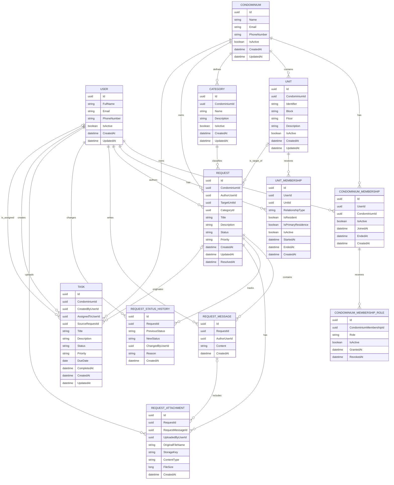

# CondoLink — Entity Relationship Diagram

## Objetivo

Este documento apresenta as entidades do domínio do CondoLink e seus principais relacionamentos no MVP.

O diagrama é conceitual. Regras detalhadas de negócio devem permanecer em `DOMAIN.md` e os fluxos de status em `WORKFLOWS.md`.

---

## Diagrama



---

## Cardinalidades principais

```text
User 1 ---- N CondominiumMembership
Condominium 1 ---- N CondominiumMembership

CondominiumMembership 1 ---- N CondominiumMembershipRole

Condominium 1 ---- N Unit

User 1 ---- N UnitMembership
Unit 1 ---- N UnitMembership

Condominium 1 ---- N Category

Condominium 1 ---- N Request
User 1 ---- N Request
Unit 0..1 ---- N Request
Category 1 ---- N Request

Request 1 ---- N RequestMessage
User 1 ---- N RequestMessage

Request 1 ---- N RequestStatusHistory
User 1 ---- N RequestStatusHistory

Request 1 ---- N RequestAttachment
RequestMessage 0..1 ---- N RequestAttachment
User 1 ---- N RequestAttachment

Condominium 1 ---- N Task
User 1 ---- N Task como criador
User 0..1 ---- N Task como responsável
Request 0..1 ---- N Task
```

---

## Observações

* `User` representa uma identidade global.
* Os papéis do usuário dependem do condomínio.
* Um usuário pode possuir vários papéis no mesmo condomínio.
* O vínculo com unidades é independente dos papéis no condomínio.
* Um síndico profissional pode não possuir vínculo com nenhuma unidade.
* Categorias pertencem ao condomínio.
* O autor da solicitação e a unidade-alvo são conceitos diferentes.
* A unidade-alvo de uma solicitação é opcional.
* `Request`, `RequestMessage`, `RequestStatusHistory` e `Task` representam conceitos diferentes.
* Uma solicitação pode originar várias tarefas.
* Uma tarefa também pode existir sem uma solicitação de origem.
* Arquivos anexados não serão armazenados diretamente no PostgreSQL.
* Entidades relacionadas devem pertencer ao mesmo condomínio quando aplicável.
